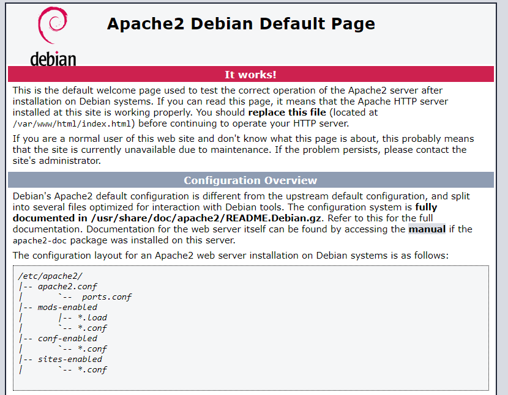

# Apache 2
Installation du serveur Apache2 sous Linux (Debian 8)

# Utilisation
Apache2 permet d'heberger des sites web.

# Installation
- Etape 1: connectez-vous à votre machine virtuelle en entrant votre login et votre mot de passe d'utilisateur;  
- Etape 2: entrez en tant que super utilisateur, tapez la commande `su` et entrez votre mot de passe de super utilisateur;  
- Etape 3: tapez la commande suivante : `apt-get install apache2` pour installer apache2;  
- Etape 4: 
 1) Vérifiez si apache2 a bien été installé avec la commande : `/etc/init.d/apache2 status`    
      
    le texte en vert signifie que apache2 a bien été installé;
 2) Trouvez votre addresse ip en tapant la commande `ip addr`,
 3) Entrer l'addresse ip de votre machine virtuelle dans la barre de recherche de votre navigateur web.
  Vous devez voir la page par défaut d'Apache;
  
    

# Configuration
Pour héberger votre site web dans Apache:
* Entrez la commande `nano /etc/apache2/apache2.conf` et cherchez la ligne : "Directory "/var/www/" et ajouter après www/ le chemin vers lequel se situe votre site web; 

Ou bien: 

* Entrez dans `cd /var/www/` et créez un nouveau fichier .html qui sera votre site web et modifier dans `nano /etc/apache2/apache2.conf` "/var/www/" en "/var/www/nom_du_nouveau_fichier.html";
