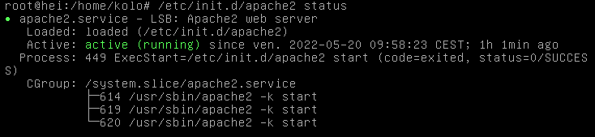

# Apache 2
Installation du serveur Apache2 sous Linux

# Installation

- Etape 1: connectez-vous à votre machine virtuelle en entrant votre login et votre mot de passe d'utilisateur;  
- Etape 2: entrez en tant que super utilisateur, tapez la commande `su` et entrez votre mot de passe de super utilisateur;  
- Etape 3: tapez la commande suivante : `apt-get install apache2` pour installer apache2;  
- Etape 4: vérifiez si apache2 a bien été installé avec la commande : `/etc/init.d/apache2 status`    
        
    le texte en vert signifie que apache2 a bien été installé;
- Etape 5: effectuez la commande suivante `nano /etc/apache2/apache2.conf`