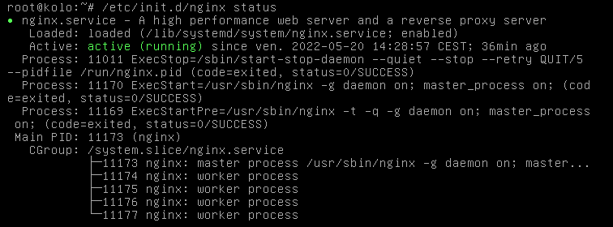

# Nginx
Installation du serveur Nginx sous Linux (Debian 8)

# Utilisation
Nginx permet de servir des fichiers statiques et comme un proxy pour les requêtes dynamiques typiquement acheminées en utilisant une interface FastCGI vers un ou des serveurs applicatifs avec un mécanisme de répartition de charge.

# Installation

- Etape 1: connectez-vous à votre machine virtuelle en entrant votre login et votre mot de passe d'utilisateur;  
- Etape 2: entrez en tant que super utilisateur, tapez la commande `su` et entrez votre mot de passe de super utilisateur;  
- Etape 3: tapez la commande suivante : `apt-get install nginx` pour installer nginx;  
- Etape 4: vérifiez si nginx a bien été installé avec la commande : `/etc/init.d/nginx status`    
      
    le texte en vert signifie que nginx a bien été installé;

# Configuration
* Effectuez la commande suivante `nano /etc/nginx/nginx.conf`.
* Modifiez l'utilisateur par défaut vérifiez le nombre de processus de travail et désactivons le journal d'accès.
    Les directives "user" et "worker_processes" sont proches du sommet: `user www-data;` `worker_processes 1;`
* Désactivez le journal d'accès: naviguez vers le bas avec les touches fléchées jusqu'à ce que vous trouviez "access_log". Modifiez-le comme suit: `access_log off;`
* Définir le "client_max_body_size" pour correspondre à certaines modifications apportées à PHP plus tard.Ajoutez juste en dessous de "access_log": `client_max_body_size 12m;`

* Pour enregistrer nos modifications et quitter vim, appuyez sur la séquence de touches suivante:

`SHIFT :(colon)`
`wq`
`Press "Enter"`

* Tapez les commandes suivantes: 
`cd conf.d`
`rm example_ssl.conf default.conf`
`vi my_site.conf`
"www.conf"

`server {
    listen 80;

    root /path/to/your/website;
    index index.php index.html index.htm;

    server_name mydomainname.com www.mydomainname.com;

    location / {
            try_files $uri $uri/ /index.php;
    }

    location ~ \.php$ {
            try_files $uri =404;
            fastcgi_param SCRIPT_FILENAME $document_root$fastcgi_script_name;
            include fastcgi_params;
            fastcgi_pass unix:/var/run/php5-fpm.sock;
    }
}`

* Il est l'heure de redémarer le serveur avec la commande : `/etc/init.d/nginx restart`